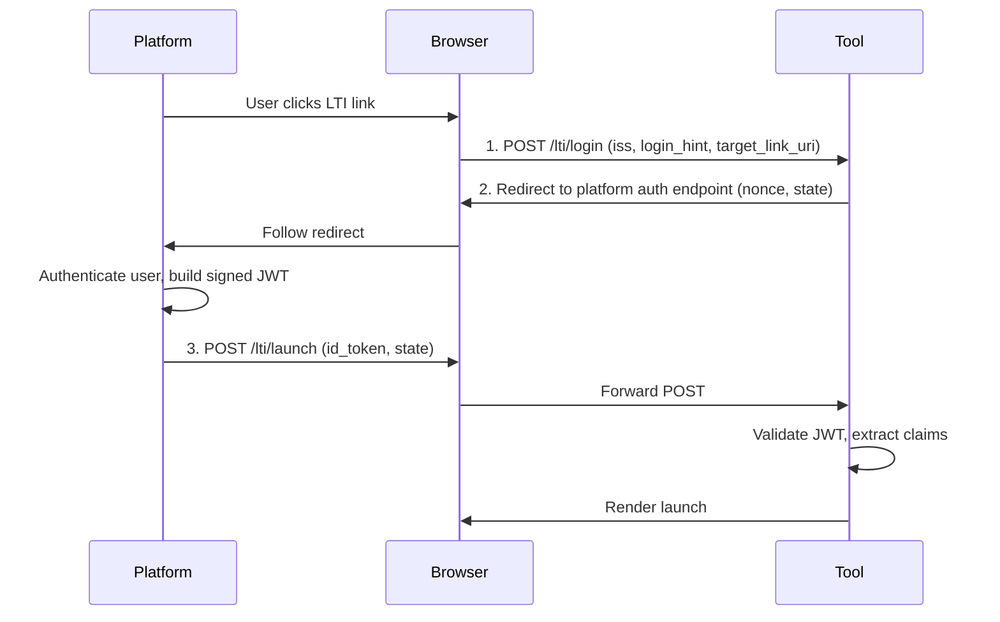

# LTI Advantage Concepts

LTI 1.3 defines how learning platforms connect with external tools.
Understanding these concepts will help you configure Ltix, implement
your storage adapter, and debug launch issues. If you're already
familiar with LTI 1.3, skip ahead to
[How Ltix fits in](#how-ltix-fits-in).

## What is LTI?

Learning Tools Interoperability (LTI) connects learning platforms
(like Canvas, Moodle, or Blackboard) with external tools (like a
quiz engine, coding sandbox, or video player). When a student clicks
a link in their course, the platform launches the tool with
information about who the user is, what course they're in, and what
role they have.

LTI 1.3 uses OpenID Connect (OIDC) for the launch flow and signed
JWTs for the data payload.

## Launch flow

An LTI launch is a three-step browser redirect:

1. **Login initiation** — the platform tells the tool "a user wants to
   launch." The tool doesn't know who yet — it just gets the platform's
   identity and a hint. Ltix handles this in `handle_login/3`.

2. **Authorization redirect** — the tool sends the browser to the
   platform's auth endpoint with a nonce and state parameter. The
   platform authenticates the user and builds a signed JWT.

3. **Launch** — the platform POSTs the signed JWT back to the tool.
   The tool validates the signature, checks the nonce, and extracts the
   launch data. Ltix handles this in `handle_callback/3`.

The state parameter (stored in the session between steps 1 and 3)
provides CSRF protection — it proves the launch callback came from
the same browser session that initiated the login.

## Registrations

A **registration** is what your tool knows about a platform. It's
created out-of-band when a platform administrator sets up your tool,
typically through a configuration UI on both sides.

A registration contains:

| Field | What it is |
|---|---|
| `issuer` | The platform's identity URL (e.g. `https://canvas.instructure.com`) |
| `client_id` | Your tool's OAuth2 client ID on that platform |
| `auth_endpoint` | Where to redirect users for authentication |
| `jwks_uri` | Where to fetch the platform's public keys |
| `token_endpoint` | Where to request access tokens for service calls (optional) |

In Ltix, this is `Ltix.Registration`. Your `Ltix.StorageAdapter`
looks up registrations by issuer during login initiation.

## Deployments

A **deployment** is a specific installation of your tool on a platform.
One registration (platform + client_id) can have many deployments —
for example, a tool installed in three different departments of the
same university.

A deployment carries a single `deployment_id` assigned by the platform.
It's immutable, case-sensitive, and guaranteed unique within the
registration.

In Ltix, this is `Ltix.Deployment`. Your storage adapter looks up
deployments during launch validation, after the JWT's deployment_id is
extracted.

## Launch claims

The signed JWT in step 3 contains **claims** — structured data about
the launch. Ltix parses these into `Ltix.LaunchClaims`:

| Claim group | Examples | Struct field |
|---|---|---|
| User identity | subject, name, email | `claims.subject`, `claims.name` |
| Roles | instructor, learner, TA | `claims.roles` (list of `%Role{}`) |
| Context | course ID, title, label | `claims.context` |
| Resource link | link ID, title | `claims.resource_link` |
| Launch metadata | message type, version, target URI | `claims.message_type`, `claims.target_link_uri` |
| Service endpoints | gradebook, names & roles | `claims.ags_endpoint`, `claims.nrps_endpoint` |
| Custom | anything the platform adds | `claims.custom`, `claims.extensions` |

The full launch result is `Ltix.LaunchContext`, which wraps the claims
together with the matched registration and deployment.

## Roles

Platforms send roles as URI strings. A user can have multiple roles
simultaneously — for example, an instructor in the course and a
staff member at the institution.

Roles have three scopes:

- **Context** — course-level: instructor, learner, TA, content developer
- **Institution** — org-level: faculty, student, staff, administrator
- **System** — platform-level: system admin, account admin

Ltix parses role URIs into `Ltix.LaunchClaims.Role` structs and
provides predicates like `Role.instructor?/1` for authorization. See
[Working with Roles](working-with-roles.md) for details.

## Nonces

A **nonce** is a one-time-use random string that prevents replay
attacks. The flow:

1. During login, Ltix generates a nonce and your storage adapter
   persists it
2. The nonce is included in the authorization request to the platform
3. The platform echoes it back in the signed JWT
4. During launch validation, Ltix asks your adapter to verify the nonce
   exists and consume it atomically

If someone intercepts a JWT and tries to replay it, the nonce check
fails because it was already consumed.

## How Ltix fits in

Ltix handles the protocol — OIDC redirects, JWT parsing, signature
verification, claim validation. Your application handles the rest:

| Ltix's job | Your app's job |
|---|---|
| Build the authorization redirect | Store the OIDC state in the session |
| Validate the JWT signature and claims | Look up registrations and deployments |
| Parse roles, context, resource links | Manage nonces (store and consume) |
| Return structured launch data | Decide what to do with the launch |
